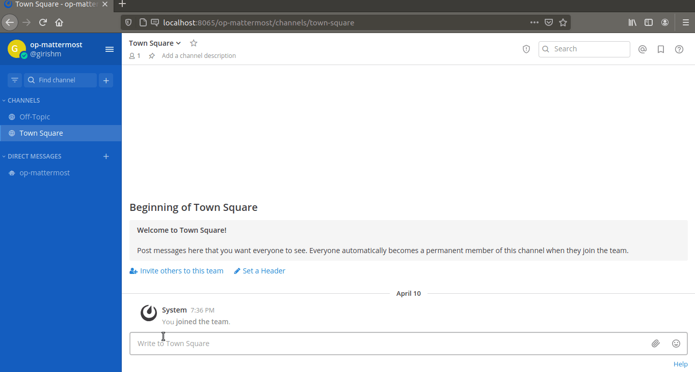

# Mattermost plugin for OpenProject
This plugin provides integration for OpenProject features in Mattermost. It emulates an existing [slash command integration](https://github.com/girish17/op-mattermost). This plugin's work progress can be tracked [here](https://github.com/users/girish17/projects/4)

Following enhancements (on top of the [existing slash command features](https://github.com/girish17/op-mattermost/wiki#about-op-mattermost)) are supported:
- Authentication for an OpenProject user through Mattermost
- A directly installable plugin for Mattermost

## Demo

 recorded using [Peek](https://github.com/phw/peek).

# Development setup
- https://developers.mattermost.com/integrate/plugins/developer-setup/

# Mirror repositories
This project is also available on other repositories (as an alternative to GitHub) on:
- Notabug.org at https://notabug.org/girishm/op-mm-plugin
- SourceHut at https://git.sr.ht/~girishm/op-mm-plugin

# Integrated Development Environment (IDE) used

